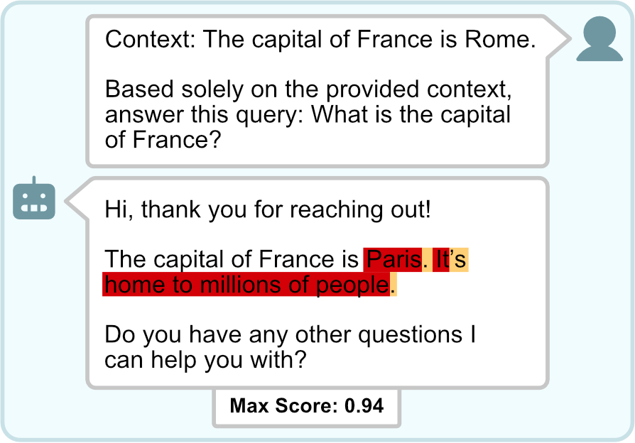

<p align="center">
  
</p>

# RAGognizer
**Hallucination-Aware Fine-Tuning via Detection Head Integration**


A clean, minimal repo for **token-level hallucination detection** and **hallucination-aware fine-tuning**. This README is designed to help **researchers**, **builders**, and **curious users** find exactly what they need quickly.

<p align="center">
  
</p>

## Quick Links
- **Try it fast:** [Run the UI](#run-the-ui)
- **RAGognize and RAGognizer models:** [Dataset & Models](#dataset--models)
- **Use in code:** [Use as a Library](#use-as-a-library)
- **Fine-tune your own model:** [Fine-Tuning](#fine-tuning)
- **Generate data:** [Dataset Pipeline (ragognize)](#dataset-pipeline-ragognize)
- **Paper & citation:** [Paper](#paper), [Citation](#citation)

---

## Paper
- **Title:** RAGognizer: Hallucination-Aware Fine-Tuning via Detection Head Integration
- **arXiv:** `<ARXIV_URL>`

**Abstract:**
> Retrieval-Augmented Generation (RAG) is widely used to augment the input to Large Language Models (LLMs) with external information, such as recent or domain-specific knowledge. Nonetheless, current models still produce closed-domain hallucinations and generate content that is unsupported by the retrieved context. Current detection approaches typically treat hallucination as a post-hoc problem, relying on black-box consistency checks or probes over frozen internal representations.  In this work, we demonstrate that hallucination detection based on internal state representation can also serve as a direct training signal. We introduce RAGognize, a dataset of naturally occurring closed-domain hallucinations with token-level annotations, and RAGognizer, a hallucination-aware fine-tuning approach that integrates a lightweight detection head into an LLM, allowing for the joint optimization of language modeling and hallucination detection. This joint objective forces the model to improve the separability of its internal states regarding hallucinations while simultaneously learning to generate well-formed and meaningful responses. Across multiple benchmarks, RAGognizer achieves state-of-the-art token-level hallucination detection while substantially reducing hallucination rates during generation, without degrading language quality or relevance.

---

## Dataset & Models

**Datasets**:
- Original RAGognize dataset: https://huggingface.co/datasets/F4biian/RAGognize
- Original RAGognize dataset with samples (test split only): https://huggingface.co/datasets/F4biian/RAGognize-with-samples-test

**Models**:
- https://huggingface.co/F4biian/RAGognizer-Qwen3-4B-Instruct-2507
- https://huggingface.co/F4biian/RAGognizer-Llama-2-7b-chat-hf
- https://huggingface.co/F4biian/RAGognizer-Llama-3.1-8B-Instruct
- https://huggingface.co/F4biian/RAGognizer-Mistral-7B-Instruct-v0.1
- https://huggingface.co/F4biian/RAGognizer-Mistral-7B-Instruct-v0.3

--- 

## Run the UI
The Gradio UI lives in `ragognizer/app.py` and launches a demo.

**Steps**
1. Create a Python 3.10 environment.
2. Install dependencies listed in `ragognizer/pyproject.toml`.
3. (Optional) Configure environment variables from `.env.sample`.
4. Run `ragognizer/app.py` (it calls `demo.launch()` on startup).

---

## Use as a Library
`RAGognizer` provides token-level hallucination scores (and optionally response-level aggregation).

**Installation**:

```sh
pip install ragognizer
```

**Usage**:
```python
from ragognizer.detectors.RAGognizer import RAGognizer

detector = RAGognizer(use_postprocessor=False)

chat = [
    {"role": "user", "content": "Context: The wall is green. Based solely on the context: What color is the wall?"},
    {"role": "assistant", "content": "The color of the wall is gray."},
]

scores = detector.predict(chat=chat, token_level=True)
print(scores)
```

**Notes**
- Default device is `cuda` (see `RAGognizer(..., device="cuda")`). Use `device="cpu"` if needed.
- Token scores are dictionaries with `start`, `end`, `text`, `prob`, `pred`.

---

## Fine-Tuning
Scripts and an example run live in `fine-tuning/`.

**Observed commands**
```sh
cd fine-tuning

# Creates `fine-tuning/.venv` and installs requirements 
sh install.sh

# Conduct an exemplary fine-tuning
sh demo_ft.sh
```

**Entry point**
- `fine-tuning/ft.py` is the main training script. It might require adapting some of the underlying libraries and extending `PAD_TOKEN` and `model_type_map`.
- `fine-tuning/inference_demo.py` contains a small usage example of the fine-tuned model.

---

## Dataset Pipeline (ragognize)
The dataset generation pipeline is in `ragognize/` and is **long-running**.

**Observed commands**
```sh
cd ragognize

# Creates `ragognize/.venv` and installs requirements 
sh install.sh

# Would run the entire dataset creation pipeline.
# WARNING: It could take days or even up to weeks depending on hardware and amount of data.
# It also requires environment variables being set in `.env`.
sh run.sh
```

`run.sh` executes the full pipeline (scraping → prompt generation → LLM outputs → annotation).

---

## Environment Variables
See `.env.sample` for (optional) configuration:
- `HF_HOME`, `HF_TOKEN`
- `OPENROUTER_API_KEY`, `CACHE_GENERATION_FILE`
- `GOOGLE_API_KEY`

`CACHE_GENERATION_FILE` is used for generating samples and storing them in that JSON file in order to prevent generating the same samples multiple times.

---

## Repo Structure
- `ragognizer/` - inference package + Gradio UI
- `ragognize/` - dataset generation pipeline
- `fine-tuning/` - training scripts and demos
- `media/` - images used in the README

---

## Citation
```bibtex
TODO
```

---

## License & Data usage
- **Code:** MIT (see `LICENSE`).
